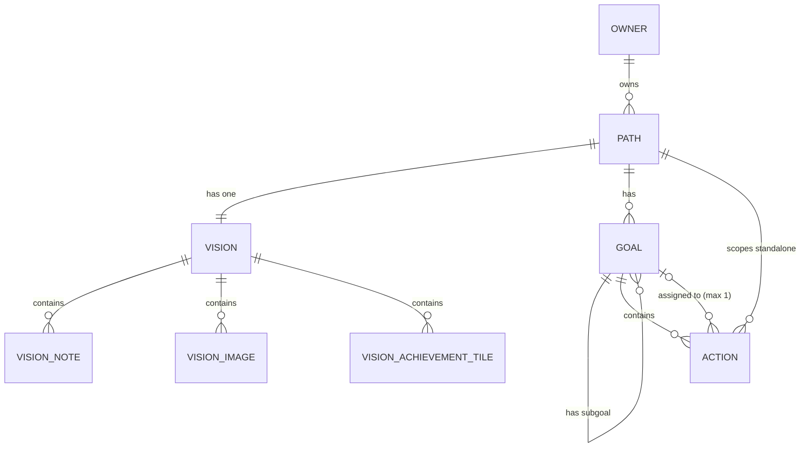

# Entity Map

Single role: **Owner** (the sole user). Everything below is owned by the Owner; there is no sharing or collaboration.

## Diagram

Derived views (not stored entities): **WinLog** and **ContributionGraph** — both computed from `Action.completedAt` / `Goal` achievement over time. The **ActionsView** (`actions` module) is likewise derived — a grouped read of `Path` → `Goal` → `Action` (plus Inbox items), writing only through the owning modules' hooks; no stored state of its own.

Relationship notes:
- An `Action` lives in exactly one of three places: the **Inbox** (no Path, no Goal), directly under a **Path** (standalone), or under a **Goal**. It never belongs to more than one `Goal`.
- A `Goal` always belongs to exactly one `Path` and may nest into a tree of sub-`Goal`s.
- A `Vision` is a 1:1 container for a `Path`; it holds an ordered mix of `VisionNote`, `VisionImage`, and `VisionAchievementTile` tiles.
- Achievements are Vision tiles (ADR 0037) — they hang off the Path's Vision, not the Path record. Creating a Path can seed them through `useVision`.

## Entities

### Path
**Description**: Top-level, never-ending direction of life (the sport path, the earnings path). The container everything else sits under.
**Instances per user**: Many (a handful active at a time).
**Ownership**: Owner.
**Lifecycle**: Created with a name (the New Path dialog's achievement rows seed achievement tiles onto the new Vision). Never "completed". Can be archived, then deleted. **Deleting a Path cascades** — removes its Vision (with all its tiles, achievements included), Goals and Actions — behind a confirmation dialog ("are you sure?").
**States**: `active` → `archived` (reversible) → *deleted*.
**Contains**: one `Vision`, many `Goal`, many standalone `Action`.
**Belongs to**: Owner.

### Vision
**Description**: The picture of the future for a Path — a Notion-like collection of short notes, image tiles, and achievement tiles rather than one long document. Exportable: tiles merge into a single markdown document.
**Instances per user**: One per Path.
**Ownership**: Owner.
**Lifecycle**: Exists for the life of the Path (created lazily when the Owner first adds to it; eagerly when Path creation seeds achievement tiles). Dies with the Path.
**States**: none (always editable).
**Contains**: many `VisionNote`, many `VisionImage`, many `VisionAchievementTile` (one shared order).
**Belongs to**: `Path`.

### VisionNote
**Description**: A short text block in the Vision (how the Owner wants to feel, small things they want, fragments). Kept small on purpose — no need to keep editing one big text.
**Instances per user**: Many per Vision.
**Ownership**: Owner.
**Lifecycle**: Created, edited, reordered, deleted freely.
**States**: none.
**Contains**: —
**Belongs to**: `Vision`.

### VisionImage
**Description**: A photo tile on the Vision board — a separate item from notes, forming a gallery. Sourced from local upload or fetched from Unsplash.
**Instances per user**: Many per Vision.
**Ownership**: Owner (Unsplash images carry attribution).
**Lifecycle**: Added, reordered, removed.
**States**: none.
**Contains**: —
**Belongs to**: `Vision`.

### VisionAchievementTile
**Description**: A thing to reach "along the way", living on the Vision board as a tile (ADR 0037, moved off the Path record) — order-independent, not a task and not requiring concrete actions ("I can do a pull-up", "muscle-up", "100 push-ups"). Renamed from "Milestone" because milestones read as sequential; these are not. Ticked in place on the board.
**Instances per user**: Many per Vision.
**Ownership**: Owner.
**Lifecycle**: Added from the board's Add menu (often seeded during Path creation), edited inline, reordered with the board's shared order, ticked/unticked, deleted with the tile menu.
**States**: `open` ↔ `achieved` (with a date; **reversible** — mistakes happen; re-ticking after a mistaken un-tick stamps today, matching the Goal/Action convention).
**Contains**: —
**Belongs to**: `Vision`.

### Goal
**Description**: An execution-oriented sub-goal with a work layer — contains tasks and needs concrete actions to move forward. Distinct from Vision and from Achievement.
**Instances per user**: Many per Path, shown in a manual priority order (not sequential).
**Ownership**: Owner.
**Lifecycle**: Created with name + description + optional deadline (with a days-remaining countdown). Achieved manually (not auto when all tasks done). Can be abandoned instead.
**States**: `active` → `achieved` (with date) | `abandoned`.
**Contains**: sub-`Goal`s (tree), many `Action`.
**Belongs to**: `Path` (always exactly one); optionally a parent `Goal`.
**Flags**: `frog` — marking a Goal as a frog marks all its Actions as frogs too.

### Action
**Description**: An atomic thing to do. For now just a name; estimated time/energy, richer fields come later.
**Instances per user**: Many.
**Ownership**: Owner.
**Lifecycle**: Captured (often into the Inbox), triaged (assigned to a Path/Goal, or promoted into a `Goal` if it turns out to need many actions), optionally scheduled to a day, completed or abandoned. Abandoned Actions are reviewed later and then finally deleted.
**States**: `inbox` → `assigned` → `done` (with `completedAt`) | `abandoned`. "Scheduled" is not a state — it is the presence of `scheduledDate`.
**Contains**: —
**Belongs to**: exactly one of — nothing (`inbox`), a `Path` (standalone), or a `Goal` (max one). Movable between Paths and Goals.
**Flags**: `frog`; `scheduledDate`; `completedAt`.

## Derived views

### WinLog
Append-feeling history of completed `Action`s and achieved `Goal`s, ordered by completion date. Un-checking an Action removes it from the log; deleting the Action removes it from history (see Open Questions in PROJECT.md — whether history should survive deletion is unresolved).

### ContributionGraph
GitHub-contribution-graph-style visualization of cumulative wins toward a Goal / Path over time. Emphasis on accumulation ("how much I've already done"), not percent-complete.
