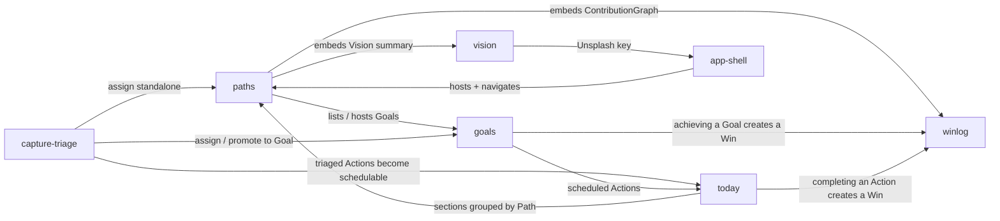

# Module Breakdown

## Overview

Bricks splits into **6 design modules** plus a generic app shell. Everything hangs off `Path` (the `paths` module), so it is the foundation. The core value loop runs across four modules — capture an idea (`capture-triage`), decide where it belongs (`capture-triage` → `goals`/`paths`), schedule and do it (`today`), and watch the wins accumulate (`winlog`). `vision` is a rich, mostly self-contained surface that sits alongside the loop rather than inside it.

Five of the six modules are **Core** — this is a focused personal tool with almost no infrastructure surface beyond persistence and navigation.

## Modules

### paths
**Type**: Core
**Description**: The container layer. Create and manage never-ending life directions (the sport path, the earnings path), seed and tick off order-independent `Achievement`s, and see the per-Path hub screen that pulls together the Vision summary, the Goal list, Achievements, and the contribution graph. Archiving and cascade-delete (with confirmation) live here.
**Entities**: `Path`, `Achievement`
**Key Actions**: Create Path (+ initial Achievements), rename, reorder, archive/unarchive, delete (cascade), view Path overview; add/edit/delete Achievement, mark/un-mark achieved.
**Connects to**: `vision` (Path overview embeds Vision summary; "open Vision board"); `goals` (Path overview lists Goals; Goals are created under a Path); `winlog` (Path overview embeds ContributionGraph for the Path); `today` (Today view groups Actions by Path); `capture-triage` (an Action can be assigned standalone to a Path).
**Design priority**: High — it is the hub screen every other module surfaces through, and the mental model (the "Path") has to land here first.

---

### vision
**Type**: Core
**Description**: A Notion-like board per Path — an ordered mix of short text notes and photo tiles rather than one long document. Photos come from local upload or an Unsplash search. The whole board exports to a single merged markdown document.
**Entities**: `Vision`, `VisionNote`, `VisionImage`
**Key Actions**: Open Vision board, add/edit/delete/reorder note, upload image, fetch from Unsplash, remove/reorder image, export Vision.
**Connects to**: `paths` (one Vision per Path; Path overview shows a Vision summary and links in); `app-shell` (Unsplash API key lives in settings).
**Design priority**: Medium — highest craft effort (block editor + gallery + external image source + export), but independent of the core value loop, so it can be prototyped after the loop is proven.

---

### goals
**Type**: Core
**Description**: The execution layer under a Path. A tree of `Goal`s and sub-`Goal`s in manual priority order, each with an optional deadline and days-remaining countdown. Goals are marked achieved manually (or abandoned), can be flagged as a frog (which propagates to their Actions), and can be moved between Paths. A per-Goal progress view shows the cumulative action count and contribution graph toward that Goal.
**Entities**: `Goal`
**Key Actions**: Create Goal / sub-Goal, edit, reorder by priority, move to another Path, toggle frog, mark achieved, abandon, reactivate, delete, view Goal progress.
**Connects to**: `paths` (every Goal belongs to exactly one Path); `capture-triage` (Actions get assigned to Goals; an Action can be promoted into a Goal); `today` (a Goal's scheduled Actions show up in Today); `winlog` (achieving a Goal creates a Win).
**Design priority**: Medium-High — the tree + priority ordering + frog propagation + achieve/abandon lifecycle is structurally the richest entity, and it is the bridge between the container and the daily work.

---

### capture-triage
**Type**: Core
**Description**: The front door for actions and the antidote to decision paralysis. Capture an `Action` idea with just a name into the Inbox without deciding anything. Later, enter a dedicated card-by-card review mode (DoItDone / AutoWork pattern) that steps through Inbox items one at a time: assign to a Path or Goal, mark standalone, discard, or promote to a Goal if the item turns out to need many actions.
**Entities**: `Action` (states `inbox` → `assigned`)
**Key Actions**: Capture to Inbox, open Inbox review, process next item, assign to Path/Goal, mark standalone, promote Action to Goal, discard item, move Action between Goals/Paths.
**Connects to**: `goals` (assign to / promote into a Goal); `paths` (assign standalone to a Path); `today` (triaged Actions become schedulable).
**Design priority**: High — the card-by-card processing flow is the most novel interaction in the app and central to the "deliberate action without paralysis" promise. `PairwisePrioritization` is deferred but this is where it will land.

---

### today
**Type**: Core
**Description**: The daily execution surface and the app's landing screen. Sections per Path, each listing that day's scheduled Actions — the focus for today. Frogs and high-value items are visually called out. Day navigation steps forward and back; a separate agenda / schedule view lays out day-header + tasks down a list. Scheduling an Action to a day and completing / un-completing it happen here.
**Entities**: `Action` (`scheduledDate`, `completedAt`, `done`/`abandoned`)
**Key Actions**: Open Today view, navigate days, open Schedule view, schedule/unschedule Action, complete/un-complete Action, abandon Action, review abandoned Actions, delete Action.
**Connects to**: `paths` (grouping is by Path); `goals` (Actions belong to Goals); `capture-triage` (Actions arrive from triage; frog flag set upstream); `winlog` (completing an Action creates a Win).
**Design priority**: High — highest daily-use impact. The information hierarchy (what's valuable vs what's a frog, per-Path sectioning, day focus vs full list) is the core of the product experience.

---

### winlog
**Type**: Core
**Description**: The motivational payoff and the #1 differentiator vs Griply. A chronological history of completed Actions and achieved Goals, plus a GitHub-contribution-graph-style visualization of cumulative wins — global, per Path, and per Goal. Emphasis on accumulation ("how much I've already done"), not percent-complete, as a deliberate counterweight to negative bias.
**Entities**: none stored — derived from `Action.completedAt` and `Goal` achievement.
**Key Actions**: Open WinLog, open ContributionGraph (global / per Path / per Goal).
**Connects to**: `today` (completed Actions feed it); `goals` (achieved Goals feed it; per-Goal graph shown in Goal progress); `paths` (per-Path graph shown in Path overview).
**Design priority**: High — it is the reason the app exists over alternatives. The design risk is emotional: making the accumulating "bricks" genuinely rewarding to look at.

---

### app-shell
**Type**: Generic
**Description**: Navigation between modules, the composed landing screen, the Dexie / LocalStorage persistence layer, and settings (Unsplash API key, export). Single role — `Owner` — no auth.
**Entities**: none
**Key Actions**: Navigate, configure settings.
**Connects to**: every module (hosts them).
**Design priority**: Low — mostly handled by `proto-highlevelui` and `proto-devsetup` before module design starts. No novel design problem beyond choosing the navigation pattern.

---

## Integration Map

## Prototyping Order

1. **paths** — everything else attaches to `Path`; nothing is usable without it. Establishes the container model, the hub screen, and `Achievement`s. Lowest dependency, highest downstream leverage.
2. **capture-triage** — the entry point for every `Action`. Introduces the `Action` entity and its assignment logic. Relatively self-contained and testable in isolation.
3. **goals** — needs `Path`. Completes the "where does this belong" picture that triage feeds into; Actions become properly homed.
4. **today** — needs Actions that are homed and schedulable. This is the heart of daily use and where the completion flow is born.
5. **winlog** — needs real completed Actions / achieved Goals to show anything meaningful. Build once the completion flows in `today` and `goals` exist.
6. **vision** — rich but independent of the value loop. Slot in last so craft effort doesn't delay proving the core.

`app-shell` is set up by `proto-devsetup` + `proto-highlevelui` before step 1.

## Priority Areas

- **today**: The information hierarchy is the product. Per-Path sectioning, "what's valuable" vs "what's a frog" signalling, day-focus vs full-list — get this wrong and the daily ritual doesn't stick. Most design attention.
- **winlog**: The differentiator. The `ContributionGraph` and the framing of accumulating wins must feel genuinely rewarding, not like a stats page. Emotional design risk.
- **capture-triage**: The most novel interaction — card-by-card processing to escape decision paralysis. No obvious reference in mainstream goal apps. Also the future home of `PairwisePrioritization`, so leave room for it.
- **goals**: Structurally the most complex module — self-referential tree, manual priority ordering, frog propagation, achieve/abandon/reactivate lifecycle, move-between-Paths. High risk of an over-complicated UI.
- **vision**: Highest raw craft effort (block editor + gallery + Unsplash + export), but lower risk to the core loop. Budget time, not worry.

## Open strategic questions

- ~~Whether `WinLog` history survives deletion of the underlying Action~~
  Resolved (proto-detail, winlog, 2026-09-04): it does not — `WinLog` is a
  live derived read with no stored ledger, so deleting (or un-completing) the
  source Action/Goal removes its Win immediately. See ADR 0013.
- **Unresolved from `proto-deepen`**, carried forward: exact `Action` fields
  beyond name; `PairwisePrioritization` scope (Goals-in-Path vs Actions); how
  "openness / API" manifests in a local prototype.
- `app-shell` navigation pattern (sidebar of Paths? top-level tabs for Today / Paths / Inbox / Log?) is deferred to `proto-highlevelui`.
